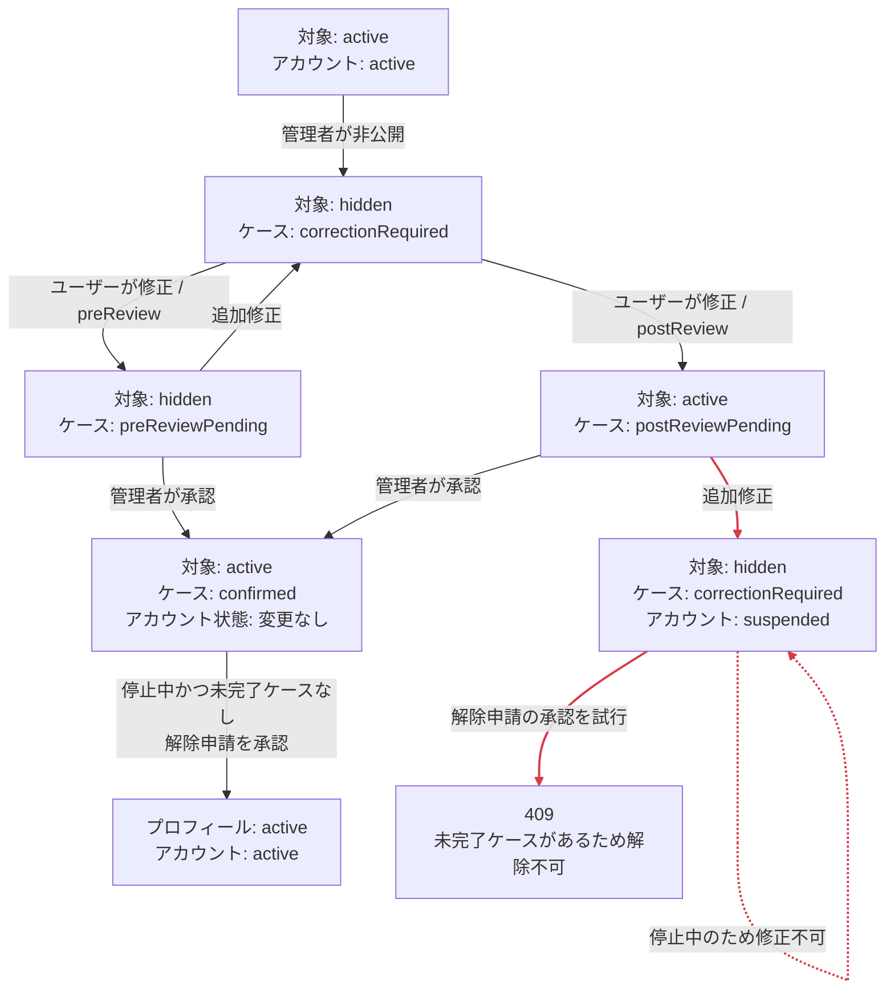
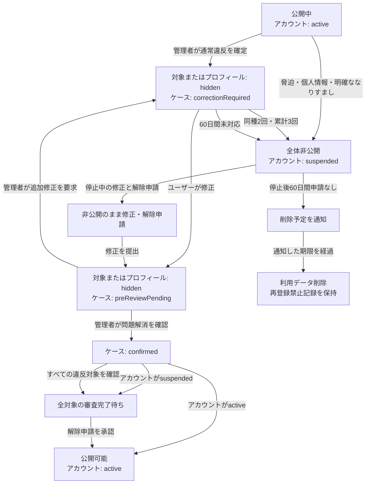

# 管理者機能の現行仕様

このドキュメントは、oto_meishiの管理者機能について、現在の実装とテストで確認できる仕様をまとめたものです。現行実装に確認されている問題と、[issue #102](https://github.com/gp-kobayashi/oto_meishi/issues/102)で決定した変更後の対応基準は、実装済みの機能と混同しないように分離して記載します。

本文中の「決定済み・未実装」は、運用方針として決定済みである一方、現在のアプリケーションでは保証されていない仕様を表します。

## 管理者権限とアクセス

### 管理者として扱われる条件

管理APIは、リクエストごとに次の条件をすべて確認します。

1. `Authorization: Bearer <access token>`がある
2. Supabase Authの`getUser`でアクセストークンを検証できる
3. Supabase AuthのユーザーIDと`AdminUser.authId`が一致する
4. `AdminUser.isActive`が`true`である
5. `AdminUser.role`が、そのAPIで許可されているロールに含まれる

ユーザーが変更可能なSupabaseの`user_metadata`は、管理者判定に使用しません。管理者の登録は、Supabase AuthのユーザーIDを`AdminUser`へ手動登録して行います。

### ロール

ロールは`moderator`と`admin`の2種類です。現行実装では、すべての管理APIが両方のロールを許可しており、操作権限に差はありません。

### アクセス方法

- 管理者専用のログイン画面はありません。
- 通常のログイン後に`/admin`へアクセスします。
- 一覧から`/admin/moderation/{profileId}`へ移動すると詳細を確認できます。
- 画面はSupabase Authのセッションからアクセストークンを取得し、管理APIへ送信します。

### 権限がない場合

| 対象 | 条件 | 現在の挙動 |
| --- | --- | --- |
| 管理API | トークンなし、空、無効 | `401`と「認証が必要です。」を返す |
| 管理API | `AdminUser`未登録、無効、許可外ロール | `403`と「管理者権限がありません。」を返す |
| 管理画面 | 未ログイン | 管理者ログインを求めるエラーを画面内に表示する |
| 管理画面 | ログイン済みだが管理者ではない | APIの`403`を受け、権限エラーを画面内に表示する |

ログイン済みの非管理者を`/profile`へ自動遷移させる挙動は、希望する運用として確認済みですが、現時点では未実装です。

## 管理画面

### 一覧画面

`/admin`には1ページ20件で、最終更新日時の降順、同一日時ではプロフィールIDの降順で表示します。

表示内容は次のとおりです。

- ユーザーID、表示名
- プロフィールの公開状態
- 音声タイトル、登録有無、公開状態、管理者向け再生ボタン
- リンク総数と非公開リンク数
- 未確認の通報件数
- 審査待ちケース件数
- 最終更新日時

利用できる操作は次のとおりです。

- ユーザーIDまたは表示名による部分一致検索（大文字・小文字を区別しない）
- `すべて`、`要対応`、`公開中`、`非公開`、`利用停止`による絞り込み
- 前後のページへの移動

任意の列を選ぶ並び替え、通報だけ・審査だけに限定する個別フィルターはありません。`要対応`には、プロフィール・音声・リンクの非公開、未確認通報、審査待ちケースのいずれかがあるプロフィールを含みます。

### 詳細画面

`/admin/moderation/{profileId}`では、次の情報を確認できます。

- プロフィールの表示名、ユーザーID、自己紹介、テーマ、公開状態、登録・更新日時
- 公開ページへのリンク
- 現在の音声、音声状態、削除済み音声の概要、保持期限内の審査用音声
- リンクのサービス、ラベル、URL、公開状態
- モデレーションケース、非公開時と修正後のスナップショット、ケースイベント
- 問い合わせ・利用停止解除申請
- 通報内容、状態、対応メモ、対応者、対応日時
- 管理操作履歴と実行者

通報、申請、ケース、管理操作履歴はそれぞれ最新50件まで表示します。

### 詳細画面から実行できる操作

| 操作 | 実行条件 | 実行後 |
| --- | --- | --- |
| プロフィールを非公開 | プロフィールが`active` | `hidden`にし、ケース、非公開時スナップショット、イベント、管理操作履歴、通知を作成する |
| 音声を非公開 | 音声が`active` | `hidden`にし、同様の記録と通知を作成する |
| リンクを非公開 | リンクが`active` | `hidden`にし、同様の記録と通知を作成する |
| プロフィールを利用停止 | プロフィールが`active` | `Profile.status`と`accountModerationStatus`を`suspended`にし、申請期限を60日後に設定して履歴と通知を作成する |
| 対象を直接復旧 | 対象が非公開で、未完了ケースがない | `active`に戻し、履歴と通知を作成する。プロフィールの場合は利用停止状態も解除する |
| ケース審査を承認 | ケースが審査待ちで、指定した最新スナップショットと現在の対象が一致 | 対象を`active`にし、ケースを`confirmed`にしてイベント、履歴、通知を作成する。削除済み対象は復元せず、アカウント停止状態は解除しない。停止中は外部公開されない |
| 非公開継続・追加修正 | ケースが審査待ち | ケースを`correctionRequired`へ戻し、イベント、履歴、通知を作成する。事後確認ケースではアカウントも利用停止にする |
| 通報状態を変更 | 通報が存在し、現在と異なる状態と500文字以内の対応メモがある | 状態、対応メモ、対応者、対応日時を更新する |
| 申請を承認・却下 | 申請が`pending`で、500文字以内の回答がある | 申請を`resolved`または`rejected`にする。解除申請は未完了ケースがない場合だけ承認でき、プロフィールとアカウントを`active`へ戻して管理操作履歴を作成する |
| 音声を再生 | 管理者として認可され、現在音声または保持期限内の音声証拠が存在 | 5分間有効な署名付きR2 URLを返す |

管理操作とケース審査はDBトランザクション内で実行します。途中の保存に失敗した場合は、公開状態、ケース、履歴、通知をまとめてロールバックします。管理操作と音声再生には管理者単位・接続元IP単位の回数制限があります。

管理者が音声・リンク・プロフィールページを直接削除する操作はありません。音声・リンクをユーザーが削除した場合は修正として記録され、ケース承認時に`remove`の履歴を残します。

## 状態遷移

### 主要ワークフロー図（現行実装）

次の図は現在の実装を示します。赤い経路は、レビューで確認された整合性問題を含む経路です。

`postReviewPending`では管理者確認前に対象が公開されます。追加修正を求めると、対象を非公開にしてアカウントも停止しますが、停止中は修正できません。ケース承認は対象を`active`にしてもアカウント停止を解除せず、停止中は外部公開されません。解除申請は、未完了ケースがある場合は`409`で拒否します。

### 通報

管理画面のUIが案内する遷移は次のとおりです。

| 現在の状態 | 契機 | 実行者 | 遷移後 | 同時に行う処理 |
| --- | --- | --- | --- | --- |
| なし | 公開カードから通報 | 利用者 | `pending` | 理由と任意の詳細を保存する |
| `pending` | 確認済みにする | 管理者 | `reviewed` | 必須の対応メモ、対応者、対応日時を保存する |
| `pending` / `reviewed` | 違反対応を完了 | 管理者 | `resolved` | 必須の対応メモ、対応者、対応日時を保存する |
| `pending` / `reviewed` | 対応不要と判断 | 管理者 | `dismissed` | 必須の対応メモ、対応者、対応日時を保存する |

現行APIは変更先として`reviewed`、`resolved`、`dismissed`のいずれかを受け付け、現在と同じ状態である場合だけ拒否します。遷移元による制限はありません。そのため、UIを経由しない場合の許可範囲は次のとおりです。

| 遷移 | 現行API |
| --- | --- |
| `pending` → `reviewed` / `resolved` / `dismissed` | 許可 |
| `reviewed` → `resolved` / `dismissed` | 許可 |
| `reviewed` → `pending` | `pending`を変更先に指定できないため不許可 |
| `resolved` → `reviewed` / `dismissed` | 許可 |
| `dismissed` → `reviewed` / `resolved` | 許可 |
| `resolved` / `dismissed` → `pending` | `pending`を変更先に指定できないため不許可 |

状態変更のたびに、`ContentReport`行の対応メモ、対応者、対応日時を上書きします。過去の判断を追記型の履歴として残す機能はありません。通報状態の変更だけではユーザー通知を作成しません。非公開や利用停止を別途実行した場合に、その管理操作の通知を作成します。

### モデレーションケース

| 状態 | 意味 |
| --- | --- |
| `correctionRequired` | 非公開後、ユーザーの修正待ち |
| `postReviewPending` | 修正内容を公開し、管理者の事後確認待ち |
| `preReviewPending` | 非公開を維持し、管理者の事前確認待ち |
| `confirmed` | 管理者による確認完了 |

| 現在の状態 | 契機 | 実行者 | 遷移後 | 同時に行う処理 |
| --- | --- | --- | --- | --- |
| なし | 対象を非公開 | 管理者 | `correctionRequired` | 理由、確認方式、60日後の期限、非公開時スナップショット、イベントを保存する |
| `correctionRequired`などの未完了状態 | 問題箇所を変更・削除 | ユーザー | `postReviewPending`または`preReviewPending` | 修正後スナップショットとイベントを保存し、期限を変更時点から60日後へ更新する |
| `postReviewPending` / `preReviewPending` | 最新の修正を承認 | 管理者 | `confirmed` | 現在内容とスナップショットの一致を再確認し、公開状態、イベント、履歴、通知を更新する |
| `preReviewPending` | 非公開継続・追加修正 | 管理者 | `correctionRequired` | 非公開を維持し、理由、イベント、履歴、通知を保存する |
| `postReviewPending` | 非公開継続・追加修正 | 管理者 | `correctionRequired` | 対象を非公開にし、アカウントを利用停止して理由、イベント、履歴、通知を保存する |

`harassment`、`impersonation`、`other`は`preReview`です。それ以外の`inappropriateContent`、`copyrightConcern`、`unsafeLink`、`serviceMismatch`は`postReview`です。管理APIが受け付けるのはこれらの定義済み理由だけです。内部の確認方式判定は、未知の値を受け取った場合に安全側の`preReview`を返す設計です。ただし、非公開音声をユーザーが削除した処理では、理由にかかわらずケースを`postReviewPending`へ更新する例外があります。

修正前と同じ音声ハッシュや同じ正規化URLは修正として受け付けません。プロフィールは表示名・自己紹介・テーマのうち1項目以上の変更で修正として記録されます。なりすまし案件で3項目すべての変更を必須にする判定は未実装です。

この判定が保証するのは「以前の内容から変更されたこと」だけであり、「違反が解消されたこと」ではありません。現行の`postReview`対象では、危険なリンクを別の危険なURLへ変えた場合や、著作権侵害音声を別ファイルへ変えた場合でも、管理者確認前に公開される可能性があります。

### プロフィール・音声・リンク

| 対象 | 状態 | 意味 |
| --- | --- | --- |
| プロフィール | `active` | 公開中 |
| プロフィール | `hidden` | 非公開 |
| プロフィール | `suspended` | 利用停止 |
| 音声 | `active` | 公開中 |
| 音声 | `hidden` | 非公開 |
| 音声 | `removed` | ユーザーによる削除済み |
| リンク | `active` | 公開中 |
| リンク | `hidden` | 非公開 |

公開・非公開は管理者の直接操作、ユーザー修正後の確認方式、ケース審査によって遷移します。管理者の直接復旧APIは、未完了ケースがある対象を復旧できません。解除申請も未完了ケースがある場合は承認できません。ケース承認は対象を`active`にしますが、アカウント停止状態は変更しません。リンク削除は状態を残さず行データを削除します。

公開プロフィールページと公開プロフィール取得APIは、`Profile.status === "active"`かつ`accountModerationStatus === "active"`の場合だけプロフィールを返します。プロフィールが公開されている場合、音声は`audioStatus === "active"`、リンクは各リンクの`status === "active"`のものだけを表示します。公開音声再生APIもプロフィール、アカウント、音声の3状態がすべて`active`の場合だけ署名付きURLを発行します。

### 利用停止と解除

| 現在の状態 | 契機 | 実行者 | 遷移後 | 同時に行う処理 |
| --- | --- | --- | --- | --- |
| `active` | 詳細画面から利用停止 | 管理者 | `suspended` | プロフィールも`suspended`にし、60日後を解除申請期限として履歴と通知を作成する |
| `active` | 事後確認で問題が残る | 管理者 | `suspended` | 対象を非公開にし、ケースを`correctionRequired`へ戻して履歴と通知を作成する |
| `suspended` | 60日以内に解除申請 | ユーザー | `suspended`のまま | `accountAppeal`を`pending`で作成する |
| `suspended` | 解除申請を承認 | 管理者 | `active` | 未完了ケースがないことを確認し、プロフィールとアカウントを公開して申請を`resolved`にし、復旧履歴を作成する |
| `suspended` | 解除申請を却下 | 管理者 | `suspended`のまま | 申請を`rejected`にして回答を保存する |

停止中はプロフィール・音声・リンクを変更できません。したがって、事後確認を差し戻してケースを`correctionRequired`へ戻すと同時にアカウントを停止した場合、ユーザーは要求された修正を行えません。未処理の解除申請は同時に1件だけ作成できます。`deletionPending`と`deletionScheduledAt`はDB定義と申請拒否判定には存在しますが、そこへ遷移させる管理処理、期限経過処理、完全削除処理は未実装です。

## 通知

### 現在通知を作成する操作

- プロフィール・音声・リンクの非公開と復旧
- プロフィールの利用停止
- ケース審査の承認、非公開継続、追加修正依頼

直接の状態変更では定型のタイトルと本文を保存し、管理者が入力した理由は関連する`ModerationAction.reason`に保存します。ケース審査では、管理者が入力した500文字以内のユーザー向け理由を通知本文にも保存します。

通知一覧には最新20件を表示し、次の情報を返します。

- タイトル、本文
- 対象種別と対象名
- 操作名と管理者が記録した理由
- 次に行う操作の案内とリンク
- 対応日時、通知日時
- 未読・既読状態

管理者の内部的な通報対応メモや通報者情報は表示しません。

### 現在通知を作成しない操作

- 通報状態の変更
- 問い合わせへの回答
- 利用停止解除申請の承認・却下
- 管理画面の閲覧、検索、音声再生
- 60日経過に伴う自動処理（自動処理自体が未実装）

サービス外へのメール・プッシュ通知はありません。FacebookなどのOAuthログインでSupabase Authにメールアドレスが保存されていても、現行のモデレーション通知はサービス内のベルだけです。

## 60日保持と削除

非公開時およびユーザー修正時に、ケースの`reviewDueAt`、`retentionExpiresAt`とスナップショットの`expiresAt`を60日後に設定します。ユーザーが再修正すると期限をその時点から60日後へ更新します。

現在、期限経過後に自動削除できるのは、審査用にR2で保持している旧音声だけです。

- Cloud Schedulerから内部APIを1日1回呼び出す運用を想定しています。
- 内部APIは`MODERATION_CLEANUP_SECRET`のBearer認証を要求します。
- 期限切れスナップショットのR2オブジェクト参照を確認し、現在のプロフィールや期限内スナップショットから参照されていない場合だけR2オブジェクトを削除します。
- R2削除後、期限切れスナップショットの`storageObjectKey`を`null`にします。
- スナップショット行、プロフィール・リンクのJSONスナップショット、ケース、ケースイベント、通報、管理操作履歴は削除しません。
- 保持期限を過ぎた音声は管理者向け署名付き再生URLを発行できません。
- ケースが審査中かどうかは削除対象の判定条件に含まれないため、管理者確認が60日を超えると審査中でも旧音声が削除される可能性があります。

60日経過時のケース自動確認、事前確認待ちの自動公開、未修正ユーザーの自動利用停止、削除予定への移行、自動通知は未実装です。定期実行環境を設定しなければ、旧音声のR2削除も実行されません。

## 決定済みの対応基準（段階実装中）

この節は、[issue #102](https://github.com/gp-kobayashi/oto_meishi/issues/102)で決定した変更後の仕様です。各項目は関連PRで段階的に実装します。現行仕様に反映済みの項目と未実装の項目を混同しないよう、実装状況を併記します。

このブランチでは、次の不変条件を実装済みです。

- アカウント停止中は、公開プロフィールページ、公開プロフィール取得API、公開音声再生APIから外部公開しない。
- ケース承認は対象を確認済みにしても、アカウント停止を解除しない。
- 未完了ケースがある間は解除申請を承認しない。

これら以外の本節の項目は未実装です。

### 公開と審査の不変条件

- 通報件数だけでは自動的に非公開にせず、管理者が対象内容を確認して違反を判断する。
- 非公開にした対象は、理由を問わず修正後も管理者確認まで公開しない。
- `postReviewPending`（事後確認待ち・公開中）を廃止し、すべて公開前確認へ統一する。
- ファイル、URL、プロフィール項目が変わったことだけでなく、問題が解消されたことを管理者が確認する。
- `accountModerationStatus`が`suspended`の場合は、プロフィールや個別コンテンツが`active`でも外部公開しない。
- ケース承認だけではアカウント停止を解除しない。
- 解除申請だけでは未完了ケースを公開しない。
- すべての違反箇所について修正提出と公開可能判定が完了した場合だけ、解除申請を承認して公開する。

変更後は修正内容を常に非公開で審査します。ケース承認とアカウント停止解除を分離し、アカウントが`active`で、必要なすべてのケースが承認済みの場合だけ外部公開します。

### 違反別の初回対応

| 違反 | 初回対応 | 再公開条件 |
| --- | --- | --- |
| サービスとURLの不一致 | 対象リンクだけを非公開 | 修正後に管理者確認 |
| フィッシングなどの危険リンク | プロフィール全体を非公開 | 安全性を管理者が確認 |
| 明確な誹謗中傷 | プロフィール全体を非公開し、修正機会を付与 | 修正後に管理者確認 |
| 脅迫・第三者の個人情報掲載 | 初回でもアカウント停止 | すべての修正と解除申請を管理者が審査 |
| 明確ななりすまし | 初回でも停止し、確認後に完全削除 | 再利用不可 |
| 他人を主体とした非公式プロフィール | プロフィール全体を非公開 | 自分自身のプロフィールへ修正後に管理者確認 |
| 根拠を確認できる著作権侵害 | 音声だけを非公開 | 公開情報による許諾確認、または音声修正後に管理者確認 |
| 根拠のない著作権通報 | 公開を継続 | 対応不要 |
| 成人向けなどの不適切な音声 | 音声だけを非公開 | 修正後に管理者確認 |
| 明確な違反ではない強い表現 | 対応なし | 通報を棄却 |
| 政治・宗教への勧誘・宣伝 | プロフィール全体を非公開 | 個人用へ修正後に管理者確認 |

政治・宗教については、個人として所属や信条を紹介することは許可します。政党・政治団体・宗教団体への勧誘や宣伝は禁止し、他宗教、他政党、その支持者への攻撃は誹謗中傷として扱います。思想や教義の正しさは管理者が判断しません。

### 違反回数と停止中の操作

- 同種の違反は2回目で利用停止にする。
- 異なる違反でも、管理者が確定した違反の累計3回目で利用停止にする。
- 同一事案への複数通報は違反1回として扱い、通報件数を違反回数にしない。
- 第三者による不正操作でも、公開サービス上の危険として違反1回に数える。繰り返された場合は利用停止にする。
- 本人確認に成功してなりすましではないと確定した場合は、違反回数を取り消す。
- 停止中でも、外部へ公開しない状態での修正と解除申請を許可する。
- 解除申請には、すべての違反箇所について、どこをどのように修正したかと申請理由を記載させる。

### 本人確認と著作権確認

なりすましの本人確認では身分証明書を収集しません。利用者が登録SNSへ投稿する内容を事前に申請し、申請から10分以内に一致する任意の文章または写真を投稿できることで、SNSを操作できることを確認します。確認できない間はプロフィールの非公開を維持します。

著作権通報では、通報者側に元音声、権利者ページ、比較可能なURLなどの根拠を求めます。個別契約や非公開の許諾について管理者は真正性を判断せず、公式ページなどの公開情報から利用許可を確認できる場合だけ再公開します。明確な侵害根拠がなければ公開を継続し、個人情報を含む契約書は収集しません。

### 期限、削除、再登録

- 非公開処分から60日以内の修正・申請を利用者の義務とし、対応がなければアカウントを停止する。
- 利用者が期限内に修正・申請した時点で利用者側の期限進行を止め、管理者確認待ちのまま非公開を維持する。
- 管理者の確認遅延を理由に自動公開、自動停止、自動削除しない。
- 停止後も60日間解除申請がなければ削除予定日を通知し、期限後にアカウントと利用データを削除する。
- 審査中の証拠データは60日を超えても保持し、審査完了後から60日経過した時点で旧証拠データを削除する。
- 完全削除後の再登録は禁止する。利用データは削除し、再登録防止に必要な認証ID、復元困難な照合値、削除理由、削除日時、禁止状態だけを保持する。

### 通報状態と履歴

- 未ログイン通報を維持し、IP単位と対象単位の回数制限を適用する。
- 通報件数だけでは自動非公開にしない。
- 終了した通報は再オープンせず、新しい証拠や再発は新しい通報として審査する。
- 通報状態は前方向にだけ遷移させる。
- 過去の判断、対応メモ、担当者、日時を上書きせず、追記型の履歴として保存する。

## 未対応・既知の制約・検討事項

### 既知の整合性問題

- `postReview`の差し戻しはアカウントを停止しながらケースを修正待ちへ戻すため、ユーザーが必要な修正を実行できない。
- `postReview`では、問題の解消ではなく内容の変更だけで管理者確認前に再公開される可能性がある。
- 通報APIは終了済み状態から別の終了状態・確認済み状態へ遷移でき、対応情報を上書きする。
- 審査中であっても期限切れの旧音声が削除される可能性がある。

これらは[issue #102](https://github.com/gp-kobayashi/oto_meishi/issues/102)の関連PRで修正します。修正が完了するまで、管理者は`postReview`の差し戻し、通報状態の再変更、審査証拠の保持期限を慎重に確認する必要があります。

### 現在利用できない機能

- 管理者専用ログイン、管理者MFA
- `admin`と`moderator`の権限差
- 複数対象への一括操作
- 管理者による音声・リンク・プロフィールページの直接削除
- 音声内容、著作権違反、リンク違反の自動判定
- メール、Web Push、モバイルPushによる通知
- `deletionPending`への運用遷移と完全削除
- 60日期限に基づくケース・アカウント状態の自動遷移
- 自動処理によるユーザー通知
- なりすまし案件でプロフィールの全対象項目変更を必須にする判定
- ログイン済み非管理者の`/profile`への自動遷移
- すべての違反に対する公開前確認
- 停止中の非公開編集と修正内容を伴う解除申請
- 違反種別・確定回数に基づく自動停止判定
- 通報対応の追記型履歴
- 本人確認申請フロー
- 完全削除後の再登録防止

### 暫定的な挙動

- `admin`と`moderator`は同じ権限で扱います。
- 違反判定と修正確認は管理者が目視で行います。
- ユーザーへの連絡はサービス内通知だけです。
- 一覧の並び順は最終更新日時の降順に固定されています。
- 回数制限はアプリケーションプロセス内で管理しているため、複数インスタンスで共有されません。
- 定期削除はCloud Schedulerなど、外部の定期実行設定に依存します。

### 今後の検討事項

- 管理者MFA
- 管理者ロールごとの権限制御
- メール通知
- 音声・リンクの自動検知
- 一括操作

検討事項は実装予定を保証するものではありません。

## 更新ルール

管理者機能の追加・変更・削除を行うPRでは、実装コードとテストコードと同じPR内でこのドキュメントも更新します。特に、次の変更は必ず更新対象にします。

- 管理者権限や認可条件
- 管理画面の表示項目・操作
- 状態や状態遷移
- ユーザーへの通知内容
- データの保持・削除ルール
- 未対応機能や既知の制約

将来案を実装した場合は、「検討事項」から削除するだけでなく、該当する現行仕様、状態遷移表、通知、保持ルールを同時に更新してください。
