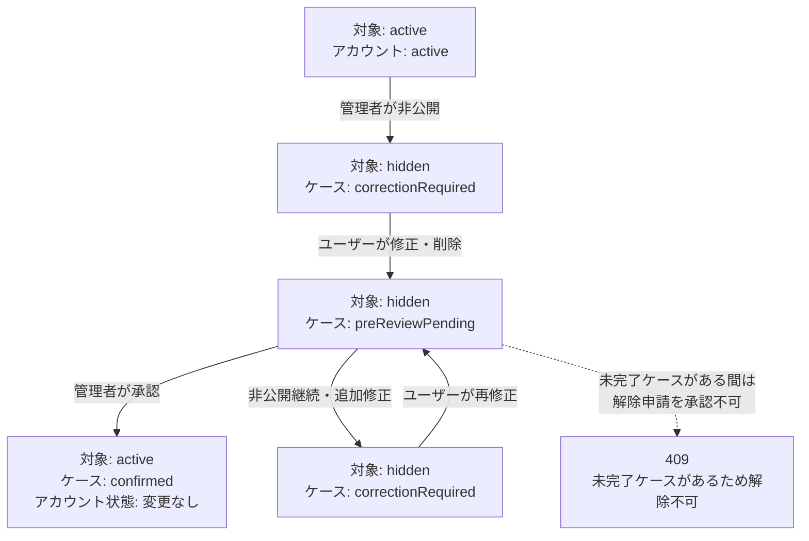
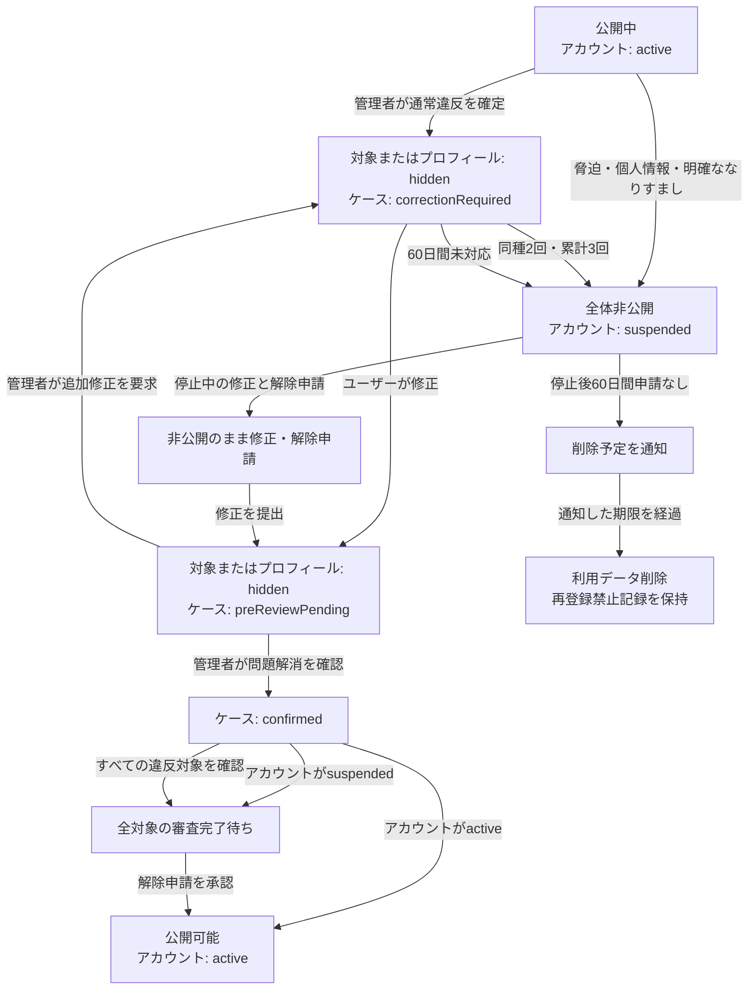

# 管理者機能の現行仕様

このドキュメントは、oto_meishiの管理者機能について、現在の実装とテストで確認できる仕様、および[issue #102](https://github.com/gp-kobayashi/oto_meishi/issues/102)で確定した通報・モデレーション対応基準をまとめたものです。

## 管理者権限とアクセス

### 管理者として扱われる条件

管理APIは、リクエストごとに次の条件をすべて確認します。

1. `Authorization: Bearer <access token>`がある
2. Supabase Authの`getUser`でアクセストークンを検証できる
3. Supabase AuthのユーザーIDと`AdminUser.authId`が一致する
4. `AdminUser.isActive`が`true`である
5. `AdminUser.role`が、そのAPIで許可されているロールに含まれる

ユーザーが変更可能なSupabaseの`user_metadata`は、管理者判定に使用しません。管理者の登録は、Supabase AuthのユーザーIDを`AdminUser`へ手動登録して行います。

### ロール

ロールは`moderator`と`admin`の2種類です。現行実装では、すべての管理APIが両方のロールを許可しており、操作権限に差はありません。

### アクセス方法

- 管理者専用のログイン画面はありません。
- 通常のログイン後に`/admin`へアクセスします。
- 一覧から`/admin/moderation/{profileId}`へ移動すると詳細を確認できます。
- 画面はSupabase Authのセッションからアクセストークンを取得し、管理APIへ送信します。

### 権限がない場合

| 対象 | 条件 | 現在の挙動 |
| --- | --- | --- |
| 管理API | トークンなし、空、無効 | `401`と「認証が必要です。」を返す |
| 管理API | `AdminUser`未登録、無効、許可外ロール | `403`と「管理者権限がありません。」を返す |
| 管理画面 | 未ログイン | 管理者ログインを求めるエラーを画面内に表示する |
| 管理画面 | ログイン済みだが管理者ではない | APIの`403`を受け、`/profile`へ自動遷移する |

この自動遷移は管理対象の一覧画面と詳細画面の両方に適用します。画面上の遷移とは別に、管理APIでも引き続き管理者権限を検証します。

## 管理画面

### 一覧画面

`/admin`には1ページ20件で、最終更新日時の降順、同一日時ではプロフィールIDの降順で表示します。

表示内容は次のとおりです。

- ユーザーID、表示名
- プロフィールの公開状態
- 音声タイトル、登録有無、公開状態、管理者向け再生ボタン
- リンク総数と非公開リンク数
- 未確認の通報件数
- 審査待ちケース件数
- 最終更新日時

利用できる操作は次のとおりです。

- ユーザーIDまたは表示名による部分一致検索（大文字・小文字を区別しない）
- `すべて`、`要対応`、`公開中`、`非公開`、`利用停止`による絞り込み
- 前後のページへの移動

任意の列を選ぶ並び替え、通報だけ・審査だけに限定する個別フィルターはありません。`要対応`には、プロフィール・音声・リンクの非公開、未確認通報、審査待ちケースのいずれかがあるプロフィールを含みます。

### 詳細画面

`/admin/moderation/{profileId}`では、次の情報を確認できます。

- プロフィールの表示名、ユーザーID、自己紹介、テーマ、公開状態、登録・更新日時
- 公開ページへのリンク
- 現在の音声、音声状態、削除済み音声の概要、保持期限内の審査用音声
- リンクのサービス、ラベル、URL、公開状態
- モデレーションケース、非公開時と修正後のスナップショット、ケースイベント
- 問い合わせ・利用停止解除申請
- なりすまし案件の本人確認申請、投稿予定内容、投稿期限、審査結果
- 通報内容、状態、対応メモ、対応者、対応日時
- 確定した違反の種別、回数、取消履歴
- 管理操作履歴と実行者

通報、申請、ケース、管理操作履歴はそれぞれ最新50件まで表示します。

### 詳細画面から実行できる操作

| 操作 | 実行条件 | 実行後 |
| --- | --- | --- |
| プロフィールを非公開 | プロフィールが`active` | `hidden`にし、ケース、非公開時スナップショット、イベント、管理操作履歴、通知を作成する |
| 音声を非公開 | 音声が`active` | `hidden`にし、同様の記録と通知を作成する |
| リンクを非公開 | リンクが`active` | `hidden`にし、同様の記録と通知を作成する |
| プロフィールを利用停止 | プロフィールが`active` | `Profile.status`と`accountModerationStatus`を`suspended`にし、申請期限を60日後に設定して履歴と通知を作成する |
| 対象を直接復旧 | 対象が非公開で、未完了ケースがなく、プロフィールの場合はアカウントが利用停止中ではない | `active`に戻し、履歴と通知を作成する。利用停止の解除は行わない |
| ケース審査を承認 | ケースが審査待ちで、指定した最新スナップショットと現在の対象が一致 | 対象を`active`にし、ケースを`confirmed`にしてイベント、履歴、通知を作成する。削除済み対象は復元せず、アカウント停止状態は解除しない。停止中は外部公開されない |
| 非公開継続・追加修正 | ケースが審査待ち | 対象の非公開を維持し、ケースを`correctionRequired`へ戻してイベント、履歴、通知を作成する |
| 通報状態を変更 | 許可された次の状態と500文字以内の対応メモがある | 状態の要約を更新し、対応メモ・対応者・対応日時を追記型履歴として保存する。終了済み通報は変更しない |
| 申請を承認・却下 | 申請が`pending`で、500文字以内の回答がある | 申請を`resolved`または`rejected`にする。解除申請は未完了ケースがない場合だけ承認でき、プロフィールとアカウントを`active`へ戻して管理操作履歴を作成する |
| 本人確認申請を承認・却下 | 申請が審査待ちで、500文字以内の説明がある | 承認時はなりすましケースを完了して対応する違反回数を取り消す。却下時は非公開と修正待ちを維持する。いずれも審査履歴と通知を作成する |
| 音声を再生 | 管理者として認可され、現在音声または保持期限内の音声証拠が存在 | 5分間有効な署名付きR2 URLを返す |

管理操作とケース審査はDBトランザクション内で実行します。途中の保存に失敗した場合は、公開状態、ケース、履歴、通知をまとめてロールバックします。管理操作と音声再生には管理者単位・接続元IP単位の回数制限があります。

管理者が音声・リンク・プロフィールページを直接削除する操作はありません。音声・リンクをユーザーが削除した場合は修正として記録され、ケース承認時に`remove`の履歴を残します。

## 状態遷移

### 主要ワークフロー図（現行実装）

次の図は現在の修正・審査フローを示します。

修正・削除後のケースは`preReviewPending`となり、管理者が問題の解消を確認するまで対象を公開しません。旧`postReviewPending`ケースも、次回の修正時に`preReviewPending`へ移行します。ケース承認は対象を`active`にしてもアカウント停止を解除せず、停止中は外部公開されません。解除申請は、未完了ケースがある場合は`409`で拒否します。

### 通報

管理画面のUIが案内する遷移は次のとおりです。

| 現在の状態 | 契機 | 実行者 | 遷移後 | 同時に行う処理 |
| --- | --- | --- | --- | --- |
| なし | 公開カードから通報 | 利用者 | `pending` | 理由と任意の詳細を保存する |
| `pending` | 確認済みにする | 管理者 | `reviewed` | 必須の対応メモ、対応者、対応日時を保存する |
| `pending` / `reviewed` | 違反対応を完了 | 管理者 | `resolved` | 必須の対応メモ、対応者、対応日時を保存する |
| `pending` / `reviewed` | 対応不要と判断 | 管理者 | `dismissed` | 必須の対応メモ、対応者、対応日時を保存する |

管理APIとDBトリガーの両方が、次の前方向遷移だけを許可します。終了済みの`resolved`と`dismissed`は再オープンできず、新しい証拠や再発は新規通報として扱います。

| 遷移 | 現行API |
| --- | --- |
| `pending` → `reviewed` / `resolved` / `dismissed` | 許可 |
| `reviewed` → `resolved` / `dismissed` | 許可 |
| `reviewed` → `pending` | `pending`を変更先に指定できないため不許可 |
| `resolved` → すべて | 不許可 |
| `dismissed` → すべて | 不許可 |
| `resolved` / `dismissed` → `pending` | `pending`を変更先に指定できないため不許可 |

`ContentReport`行には最新の対応メモ、対応者、対応日時を要約として保存します。各変更は`ContentReportStatusEvent`にも追記し、過去の判断、担当者、日時を保持します。この履歴は更新・削除できません。通報状態の変更だけではユーザー通知を作成しません。非公開や利用停止を別途実行した場合に、その管理操作の通知を作成します。

### モデレーションケース

| 状態 | 意味 |
| --- | --- |
| `correctionRequired` | 非公開後、ユーザーの修正待ち |
| `postReviewPending` | 旧データとの互換用。新規遷移では作成せず、次回修正時に対象を非公開にして`preReviewPending`へ移行 |
| `preReviewPending` | 非公開を維持し、管理者の事前確認待ち |
| `confirmed` | 管理者による確認完了 |

| 現在の状態 | 契機 | 実行者 | 遷移後 | 同時に行う処理 |
| --- | --- | --- | --- | --- |
| なし | 対象を非公開 | 管理者 | `correctionRequired` | 理由、確認方式、60日後の期限、非公開時スナップショット、イベントを保存する |
| `correctionRequired`などの未完了状態 | 問題箇所を変更・削除 | ユーザー | `preReviewPending` | 対象の非公開を維持し、修正後スナップショットとイベントを保存して期限を変更時点から60日後へ更新する |
| `postReviewPending` / `preReviewPending` | 最新の修正を承認 | 管理者 | `confirmed` | 現在内容とスナップショットの一致を再確認し、公開状態、イベント、履歴、通知を更新する |
| `postReviewPending` / `preReviewPending` | 非公開継続・追加修正 | 管理者 | `correctionRequired` | 非公開を維持し、理由、イベント、履歴、通知を保存する。審査方式だけを理由にアカウント停止にはしない |

管理APIが受け付けるのは定義済みの違反理由だけです。違反理由にかかわらず確認方式は`preReview`となり、未知の値も安全側の`preReview`を返します。プロフィール、リンク、音声の変更・削除はすべて`preReviewPending`へ遷移します。

修正前と同じ音声ハッシュや同じ正規化URLは修正として受け付けません。通常のプロフィール案件は表示名・自己紹介・テーマのうち1項目以上の変更で修正として記録されます。なりすまし案件では表示名・自己紹介・テーマと、非公開時に登録されていた音声・リンクの全項目を変更または削除する必要があります。登録済みSNSによる本人確認が承認された場合は、変更審査とは別の経路でケースを完了できます。

この判定が保証するのは「以前の内容から変更されたこと」だけであり、「違反が解消されたこと」ではありません。そのため、変更内容は非公開のまま管理者が確認し、問題の解消を確認できた場合だけ公開します。

### プロフィール・音声・リンク

| 対象 | 状態 | 意味 |
| --- | --- | --- |
| プロフィール | `active` | 公開中 |
| プロフィール | `hidden` | 非公開 |
| プロフィール | `suspended` | 利用停止 |
| 音声 | `active` | 公開中 |
| 音声 | `hidden` | 非公開 |
| 音声 | `removed` | ユーザーによる削除済み |
| リンク | `active` | 公開中 |
| リンク | `hidden` | 非公開 |

公開・非公開は管理者の直接操作、ユーザー修正後の確認方式、ケース審査によって遷移します。管理者の直接復旧APIは、未完了ケースがある対象を復旧できません。解除申請も未完了ケースがある場合は承認できません。ケース承認は対象を`active`にしますが、アカウント停止状態は変更しません。リンク削除は状態を残さず行データを削除します。

公開プロフィールページと公開プロフィール取得APIは、`Profile.status === "active"`かつ`accountModerationStatus === "active"`の場合だけプロフィールを返します。プロフィールが公開されている場合、音声は`audioStatus === "active"`、リンクは各リンクの`status === "active"`のものだけを表示します。公開音声再生APIもプロフィール、アカウント、音声の3状態がすべて`active`の場合だけ署名付きURLを発行します。

### 利用停止と解除

| 現在の状態 | 契機 | 実行者 | 遷移後 | 同時に行う処理 |
| --- | --- | --- | --- | --- |
| `active` | 詳細画面から利用停止 | 管理者 | `suspended` | プロフィールも`suspended`にし、60日後を解除申請期限として履歴と通知を作成する |
| `suspended` | 60日以内に解除申請 | ユーザー | `suspended`のまま | `accountAppeal`を`pending`で作成する |
| `suspended` | 解除申請を承認 | 管理者 | `active` | 未完了ケースがないことを確認し、プロフィールとアカウントを公開して申請を`resolved`にし、復旧履歴を作成する |
| `suspended` | 解除申請を却下 | 管理者 | `suspended`のまま | 申請を`rejected`にして回答を保存する |
| `active` | 修正・申請なしで60日経過 | システム | `suspended` | 60日後を解除申請期限として監査履歴、ケースイベント、通知を作成する |
| `suspended` | 解除申請なしで60日経過 | システム | `deletionPending` | 60日後を削除予定日として監査履歴、ケースイベント、通知を作成する |
| `deletionPending` | 削除予定日を経過 | システム | 完全削除 | 利用データ、R2オブジェクト、Supabase Authユーザーを削除し、再登録禁止記録だけを保持する |

停止中でも、プロフィール・音声・リンクは外部へ公開しない状態で変更できます。すべての違反箇所を修正したうえで、修正内容と申請理由を記載して解除申請を行います。未処理の解除申請は同時に1件だけ作成できます。削除手続き中のアカウントは、プロフィール・音声・リンクの変更および管理者の直接操作による再公開を行えません。

## 通知

### 現在通知を作成する操作

- プロフィール・音声・リンクの非公開と復旧
- プロフィールの利用停止
- ケース審査の承認、非公開継続、追加修正依頼
- 60日経過による自動利用停止と削除予定化

直接の状態変更では定型のタイトルと本文を保存し、管理者が入力した理由は関連する`ModerationAction.reason`に保存します。ケース審査では、管理者が入力した500文字以内のユーザー向け理由を通知本文にも保存します。

通知一覧には最新20件を表示し、次の情報を返します。

- タイトル、本文
- 対象種別と対象名
- 操作名と管理者が記録した理由
- 次に行う操作の案内とリンク
- 対応日時、通知日時
- 未読・既読状態

管理者の内部的な通報対応メモや通報者情報は表示しません。

### 現在通知を作成しない操作

- 通報状態の変更
- 問い合わせへの回答
- 利用停止解除申請の承認・却下
- 管理画面の閲覧、検索、音声再生

サービス外へのメール・プッシュ通知はありません。FacebookなどのOAuthログインでSupabase Authにメールアドレスが保存されていても、現行のモデレーション通知はサービス内のベルだけです。

## 60日保持と削除

非公開時およびユーザー修正時に、ケースの`reviewDueAt`、`retentionExpiresAt`とスナップショットの`expiresAt`を60日後に設定します。ユーザーが再修正すると期限をその時点から60日後へ更新します。ケースを確認済みにしたときは、証拠音声の保持期限を審査完了時点から60日後へ更新します。

期限処理は、Cloud Schedulerから2つの内部APIを1日1回呼び出す運用を想定しています。どちらも`MODERATION_CLEANUP_SECRET`のBearer認証を要求します。

### ユーザー対応期限

`POST /api/internal/moderation/deadlines`は、次の状態遷移を行います。

- `correctionRequired`のまま修正期限を過ぎたプロフィールを利用停止にする。
- 利用停止から60日間、解除申請がなく、管理者確認待ちでもないプロフィールを削除予定にする。
- 削除予定日を過ぎ、管理者確認待ちや解除申請確認中ではないアカウントを完全削除する。
- 利用停止と削除予定化の際に、システム実行の監査履歴、ケースイベント、ユーザー通知を保存する。
- 管理者確認待ちまたは解除申請確認中は、利用者側の放置ではないため期限を進めない。

完全削除では、処理対象を原子的に確保してから、他アカウントに共有されていないR2オブジェクト、プロフィールに紐づく利用データ、Supabase Authユーザーの順で削除します。Auth削除に一時的に失敗した場合は、利用データを復元せず、次回の期限処理で未完了のAuth削除だけを再試行します。処理結果では`deletionCandidates`、`deleted`、`pendingAuthDeletionsCompleted`、`failed`を確認できます。

完全削除後も、旧Auth ID、削除理由、削除完了日時、禁止状態と、メールアドレス・外部認証IDから作成したHMAC照合値だけを再登録禁止記録として保持します。生のメールアドレスや外部認証IDは保持しません。新規プロフィール作成時に有効な禁止記録と一致した場合は作成を拒否し、その新しいAuthユーザーを削除します。

### 審査用音声の保持期限

`POST /api/internal/moderation/audio-evidence/cleanup`は、次の処理を行います。

- 確認済みケースに属する期限切れスナップショットだけを対象にします。未完了ケースが同じ音声を参照している場合もR2オブジェクトを削除しません。
- 対象音声が現在のプロフィールや期限内スナップショットから参照されていない場合だけR2オブジェクトを削除します。
- R2削除後、期限切れスナップショットの`storageObjectKey`を`null`にします。
- スナップショット行、プロフィール・リンクのJSONスナップショット、ケース、ケースイベント、通報、管理操作履歴は削除しません。
- 保持期限を過ぎた音声は管理者向け署名付き再生URLを発行できません。
- 管理者確認待ち・修正要求中のケースでは、60日を超えても証拠音声を保持します。確認済みにした後、60日が経過すると削除対象になります。

60日経過時のケース自動確認と事前確認待ちの自動公開は行いません。管理者の承認が完了するまで対象は非公開です。定期実行環境を設定しなければ、ユーザー対応期限も旧音声のR2削除も処理されません。

## 通報・モデレーション対応基準

この節は、[issue #102](https://github.com/gp-kobayashi/oto_meishi/issues/102)で決定し、現在の実装へ反映した対応基準です。

実装は次の不変条件を保証します。

- アカウント停止中は、公開プロフィールページ、公開プロフィール取得API、公開音声再生APIから外部公開しない。
- ケース承認は対象を確認済みにしても、アカウント停止を解除しない。
- 未完了ケースがある間は解除申請を承認しない。
- 違反理由にかかわらず、修正・削除後は`preReviewPending`として対象の非公開を維持する。
- 旧`postReviewPending`ケースは次回修正時に`preReviewPending`へ移行する。
- 既存の`postReviewPending`ケースはDBマイグレーションで対象を非公開にし、`preReviewPending`へ一括移行する。
- 審査の差し戻しだけを理由にアカウントを自動停止しない。
- 期限経過で削除予定化し、削除予定日を過ぎたアカウントを完全削除する。
- 完全削除後は最小限のHMAC照合値でメール・外部認証IDの再登録を拒否する。
- 審査中の音声証拠は削除せず、確認済みにした後から60日間保持する。
- ユーザー画面、通知、管理画面で公開前確認の案内を表示する。
- 他人を主体としたプロフィール、政治・宗教団体への勧誘・宣伝、他集団や支持者への攻撃を利用規約で禁止する。
- なりすまし案件では、登録済みSNSと投稿予定内容を事前申請し、申請から10分以内の投稿期限を記録する。
- 管理者は申請時のSNSと投稿予定内容を照合し、本人確認の成功・失敗と説明を履歴へ保存して利用者へ通知する。

### 公開と審査の不変条件

- 通報件数だけでは自動的に非公開にせず、管理者が対象内容を確認して違反を判断する。
- 非公開にした対象は、理由を問わず修正後も管理者確認まで公開しない。
- `postReviewPending`（事後確認待ち・公開中）を廃止し、すべて公開前確認へ統一する。
- ファイル、URL、プロフィール項目が変わったことだけでなく、問題が解消されたことを管理者が確認する。
- `accountModerationStatus`が`suspended`の場合は、プロフィールや個別コンテンツが`active`でも外部公開しない。
- ケース承認だけではアカウント停止を解除しない。
- 解除申請だけでは未完了ケースを公開しない。
- すべての違反箇所について修正提出と公開可能判定が完了した場合だけ、解除申請を承認して公開する。

変更後は修正内容を常に非公開で審査します。ケース承認とアカウント停止解除を分離し、アカウントが`active`で、必要なすべてのケースが承認済みの場合だけ外部公開します。

### 違反別の初回対応

| 違反 | 初回対応 | 再公開条件 |
| --- | --- | --- |
| サービスとURLの不一致 | 対象リンクだけを非公開 | 修正後に管理者確認 |
| フィッシングなどの危険リンク | プロフィール全体を非公開 | 安全性を管理者が確認 |
| 明確な誹謗中傷 | プロフィール全体を非公開し、修正機会を付与 | 修正後に管理者確認 |
| 脅迫・第三者の個人情報掲載 | 初回でもアカウント停止 | すべての修正と解除申請を管理者が審査 |
| 明確ななりすまし | 初回でも停止し、確認後に完全削除 | 再利用不可 |
| 他人を主体とした非公式プロフィール | プロフィール全体を非公開 | 自分自身のプロフィールへ修正後に管理者確認 |
| 根拠を確認できる著作権侵害 | 音声だけを非公開 | 公開情報による許諾確認、または音声修正後に管理者確認 |
| 根拠のない著作権通報 | 公開を継続 | 対応不要 |
| 成人向けなどの不適切な音声 | 音声だけを非公開 | 修正後に管理者確認 |
| 明確な違反ではない強い表現 | 対応なし | 通報を棄却 |
| 政治・宗教への勧誘・宣伝 | プロフィール全体を非公開 | 個人用へ修正後に管理者確認 |

政治・宗教については、個人として所属や信条を紹介することは許可します。政党・政治団体・宗教団体への勧誘や宣伝は禁止し、他宗教、他政党、その支持者への攻撃は誹謗中傷として扱います。思想や教義の正しさは管理者が判断しません。

### 違反回数と停止中の操作

- 同種の違反は2回目で利用停止にする。
- 異なる違反でも、管理者が確定した違反の累計3回目で利用停止にする。
- 同一事案への複数通報は違反1回として扱い、通報件数を違反回数にしない。
- 第三者による不正操作でも、公開サービス上の危険として違反1回に数える。繰り返された場合は利用停止にする。
- 本人確認に成功してなりすましではないと確定した場合は、違反回数を取り消す。
- 停止中でも、外部へ公開しない状態での修正と解除申請を許可する。
- 解除申請には、すべての違反箇所について、どこをどのように修正したかと申請理由を記載させる。

### 本人確認と著作権確認

なりすましの本人確認では身分証明書を収集しません。利用者は編集画面から登録済みSNSと投稿予定内容を事前に申請し、申請から10分以内に一致する任意の文章または写真を投稿します。申請時のSNS URL、投稿予定内容、投稿期限は履歴として保存されます。管理者は申請内容とSNS投稿を目視で照合し、審査結果と説明を保存します。

本人と確認できた場合は、なりすましケースを確認済みにし、対応する違反回数を取り消します。利用停止中または別の未完了ケースがある場合は、本人確認に成功しても公開しません。本人と確認できない場合は非公開と修正待ちを維持し、その理由をサービス内通知で利用者へ伝えます。

違反履歴から回数だけを直接取り消す操作は使用せず、本人確認申請を確認済みにする審査操作からのみ取り消します。

著作権通報では、通報者側に元音声、権利者ページ、比較可能なURLなどの根拠を求めます。個別契約や非公開の許諾について管理者は真正性を判断せず、公式ページなどの公開情報から利用許可を確認できる場合だけ再公開します。明確な侵害根拠がなければ公開を継続し、個人情報を含む契約書は収集しません。

### 期限、削除、再登録

- 非公開処分から60日以内の修正・申請を利用者の義務とし、対応がなければアカウントを停止する。
- 利用者が期限内に修正・申請した時点で利用者側の期限進行を止め、管理者確認待ちのまま非公開を維持する。
- 管理者の確認遅延を理由に自動公開、自動停止、自動削除しない。
- 停止後も60日間解除申請がなければ削除予定日を通知し、期限後にアカウントと利用データを削除する。
- 審査中の証拠データは60日を超えても保持し、審査完了後から60日経過した時点で旧証拠データを削除する。
- 完全削除後の再登録は禁止する。利用データは削除し、再登録防止に必要な認証ID、復元困難な照合値、削除理由、削除日時、禁止状態だけを保持する。

### 通報状態と履歴

- 未ログイン通報を維持し、IP単位と対象単位の回数制限を適用する。
- 通報件数だけでは自動非公開にしない。
- 終了した通報は再オープンせず、新しい証拠や再発は新しい通報として審査する。
- 通報状態は前方向にだけ遷移させる。
- 過去の判断、対応メモ、担当者、日時を上書きせず、追記型の履歴として保存する。

## 未対応・既知の制約・検討事項

### 既知の整合性問題

現時点で把握している通報状態遷移に関する整合性問題はありません。

### 現在利用できない機能

- 管理者専用ログイン、管理者MFA
- `admin`と`moderator`の権限差
- 複数対象への一括操作
- 管理者による音声・リンク・プロフィールページの直接削除
- 音声内容、著作権違反、リンク違反の自動判定
- メール、Web Push、モバイルPushによる通知

### 暫定的な挙動

- `admin`と`moderator`は同じ権限で扱います。
- 違反判定と修正確認は管理者が目視で行います。
- ユーザーへの連絡はサービス内通知だけです。
- 一覧の並び順は最終更新日時の降順に固定されています。
- 回数制限はアプリケーションプロセス内で管理しているため、複数インスタンスで共有されません。
- 期限処理と定期削除はCloud Schedulerなど、外部の定期実行設定に依存します。

### 今後の検討事項

- 管理者MFA
- 管理者ロールごとの権限制御
- メール通知
- 音声・リンクの自動検知
- 一括操作

検討事項は実装予定を保証するものではありません。

## 更新ルール

管理者機能の追加・変更・削除を行うPRでは、実装コードとテストコードと同じPR内でこのドキュメントも更新します。特に、次の変更は必ず更新対象にします。

- 管理者権限や認可条件
- 管理画面の表示項目・操作
- 状態や状態遷移
- ユーザーへの通知内容
- データの保持・削除ルール
- 未対応機能や既知の制約

将来案を実装した場合は、「検討事項」から削除するだけでなく、該当する現行仕様、状態遷移表、通知、保持ルールを同時に更新してください。
